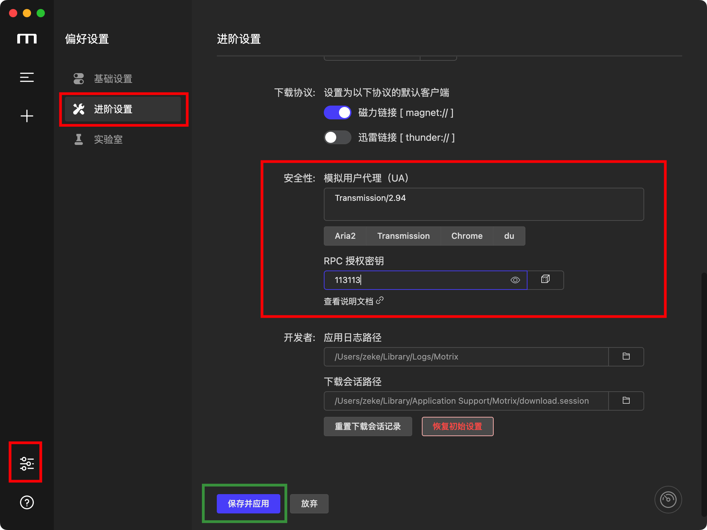
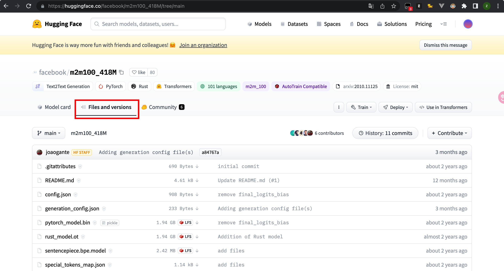

# 对于国内用户 下载huggingface模型的方法

## 参数详解

```python
# aria2服务地址
server_url = "http://localhost:16800/rpc"
# aria2 token
token = '113113'
# huggingface huggingface上模型地址
model_url = "https://huggingface.co/facebook/m2m100_418M/tree/main"
# 模型安装位置
model_download_dir = "/Users/zeke/Downloads/m2m"
```


## 部署aria2服务

部署aria2的方式这里提供两种

1. 直接使用[Motrix](https://motrix.app/)进入官网下载



设置完成后你的**aria2**服务配置即为(记得点保存)，默认配置[参考官方说明文档](https://github.com/agalwood/Motrix/wiki/RPC)

```python
server_url = "http://localhost:16800/rpc"
token = '113113'
```

2. 部署[aria2-pro](https://github.com/P3TERX/Aria2-Pro-Docker)

其中包括两个服务Aria2-Pro和一个web前端AriaNg

只需要注意

- 10行：Aria2的token
- 18-19：容器与宿主机的目录映射

```dockerfile
version: "2"
services:
  Aria2-Pro:
    container_name: aria2-pro
    image: p3terx/aria2-pro
    environment:
      - PUID=0
      - PGID=0
      - UMASK_SET=022
      - RPC_SECRET=113113
      - RPC_PORT=6800
      - LISTEN_PORT=6888
      - DISK_CACHE=64M
      - IPV6_MODE=false
      - UPDATE_TRACKERS=true
      - CUSTOM_TRACKER_URL=
      - TZ=Asia/Shanghai
    volumes:
      - /root/aria2c_config/downloads:/downloads
    ports:
     - 6800:6800
     - 6888:6888
     - 6888:6888/udp
    restart: unless-stopped
    logging:
      driver: json-file
      options:
        max-size: 1m

  AriaNg:
    container_name: ariang
    image: p3terx/ariang
    command: --port 6880 --ipv6
    ports:
     - 6880:6880
    restart: unless-stopped
    logging:
      driver: json-file
      options:
        max-size: 1m
```

设置完成后你的**aria2**服务配置即为

```python
server_url = "http://localhost:6800/rpc"
token = '113113'
```

## 补充

### model_url获取方式


